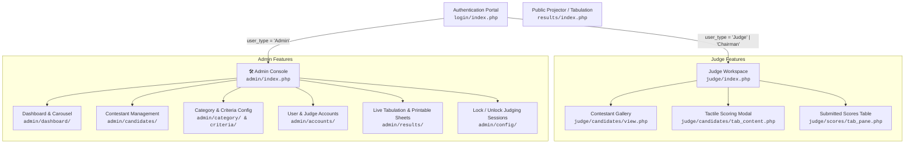

# RAMP REIGN AND RUNWAY (RRR)
### Real-Time Pageant & Intramural House Cup Tabulation System

[](https://www.php.net/)
[](https://www.mysql.com/)
[](https://getbootstrap.com/)
[](css/judge.css)
[](https://www.apachefriends.org/)

---

## Overview

**RAMP REIGN AND RUNWAY (RRR)** is an automated, scoring, tabulation, and event presentation platform built for pageants, runway competitions, and intramural House Cup events.

---

## System Architecture & Workflows



---

## Installation & Setup Guide

### Prerequisites
* **Web Server:** [XAMPP](https://www.apachefriends.org/), WAMP, LAMP, or any Apache/Nginx stack.
* **PHP:** Version `>= 7.4` (fully compatible with PHP 8.0, 8.1, and 8.2) with the `mysqli` and `gd` extensions enabled.
* **Database:** MySQL `5.7+` or MariaDB `10.4+`.
* **Web Browser:** Modern browser (Google Chrome, Apple Safari, Microsoft Edge, Mozilla Firefox) with JavaScript enabled.

---

### Step 1: Deploy Project Files
Clone or extract the repository into your local web server's document root:

* **XAMPP (Windows):** `C:\xampp\htdocs\RRR_2024`
* **XAMPP (macOS):** `/Applications/XAMPP/xamppfiles/htdocs/RRR_2024`
* **Linux (Apache):** `/var/www/html/RRR_2024`

```bash
git clone https://github.com/Masc20/RRR.git C:/xampp/htdocs/RRR_2024
```

---

### Step 2: Set Directory Permissions
Ensure the `uploads/` folder is writable by the web server process:

```bash
# On Linux / macOS
chmod -R 775 uploads/
```

---

### Step 3: Import the Database
1. Open **phpMyAdmin** (`http://localhost/phpmyadmin`) or your preferred MySQL client.
2. Create a new database named **`rrr`** with collation `utf8mb4_general_ci` or `latin1_swedish_ci`:
   ```sql
   CREATE DATABASE `rrr` DEFAULT CHARACTER SET utf8mb4 COLLATE utf8mb4_unicode_ci;
   ```
3. Import the provided [`rrr.sql`](rrr.sql) file:
   * **Via phpMyAdmin:** Select the `rrr` database &rarr; Click **Import** &rarr; Choose `rrr.sql` &rarr; Click **Go**.
   * **Via Command Line:**
     ```bash
     mysql -u root -p rrr < C:/xampp/htdocs/RRR_2024/rrr.sql
     ```

---

### Step 4: Configure Database Connection
Open [`connection/conn.php`](connection/conn.php) and verify your MySQL connection settings:

```php
<?php  
$servername = "localhost";
$username   = "root";
$password   = "";        // Default is empty on standard XAMPP installs
$dbname     = "rrr";

$conn = new mysqli($servername, $username, $password, $dbname);

if ($conn->connect_error) {
    die("Connection failed: " . $conn->connect_error);
}
?>
```

---

### Step 5: Launch the Application
Start **Apache** and **MySQL** in your control panel, then navigate to:

```text
http://localhost/RRR_2024/
```

The application will automatically route you to the Authentication Portal at `http://localhost/RRR_2024/login/`.

---

## Default User Accounts & Credentials

The seed database [`rrr.sql`](rrr.sql) includes pre-configured administrative and adjudicator accounts:

| Role | Username | Password | Default Portal | Access Permissions |
| :--- | :--- | :--- | :--- | :--- |
| **System Administrator** | `admin` | `admin123` | `/admin/` | Full system control, category setup, user CRUD, lock toggles, tabulation |
| **Committee Chairman** | `comm` | `c0mm` | `/judge/` | Executive judging, overview scoring privileges, score validation |
| **Judge #1** | `judge1` | `judge1` | `/judge/` | Contestant scoring, slider interface, individual score review |
| **Judge #2** | `judge2` | `judge2` | `/judge/` | Contestant scoring, slider interface, individual score review |
| **Judge #3** | `judge3` | `judge3` | `/judge/` | Contestant scoring, slider interface, individual score review |
| **Judge #4** | `judge4` | `judge4` | `/judge/` | Contestant scoring, slider interface, individual score review |

> **Security Best Practice:** Change all default passwords immediately after initial deployment via the **Admin Console &rarr; User Accounts** screen.

---

## Database Schema Reference

| Table | Description | Key Columns |
| :--- | :--- | :--- |
| **`tbl_config`** | Global event parameters and session locking states | `config_id`, `event_title`, `based_type` (`Candidate`/`House`), `judge_status` (`Open`/`Close`) |
| **`tbl_users`** | User credentials, roles, and account status | `user_id`, `full_name`, `user_name`, `pass_word`, `user_type` (`Admin`/`Chairman`/`Judge`), `status` |
| **`tbl_candidates`**| Contestants/Entries, division numbering, photos | `cand_id`, `cand_no` (`1F`, `1M`, etc.), `cand_name`, `cand_pic`, `status` (`Allow`/`Eliminate`) |
| **`tbl_category`**  | Competition rounds/categories and percentage weight | `category_id`, `category_name`, `percentage`, `status` (`Show`/`Hide`) |
| **`tbl_criteria`**  | Specific scoring rubrics under each category | `criteria_id`, `criteria_name`, `criteria_points`, `category_id`, `status` (`Show`/`Hide`) |
| **`tbl_scores`**    | Atomic scores submitted by judges | `score_id`, `category_id`, `criteria_id`, `user_id`, `cand_id`, `score_points`, `date_saved` |
| **`online_judges`** | Active session tracking for connected adjudicators | `session_id`, `user_id`, `time` |

---

## Troubleshooting & Frequently Asked Questions

### 1. Database Connection Error ("Connection failed")
* Verify MySQL is running in your XAMPP Control Panel.
* Confirm that the database name in [`connection/conn.php`](connection/conn.php) matches the imported database (`rrr`).
* If you set a root password in MySQL, ensure it is entered into the `$password` parameter in `conn.php`.

### 2. "Judging is now closed. Thank you." Prompt Appears
* This is the session lock feature configured in `tbl_config`.
* Log in as an **Admin** (`/admin/`), go to **Event Configuration**, and set **Judge Status** to **Open**.

### 3. Contestant Photos Fail to Upload
* Check write permissions on the `uploads/` folder.
* Ensure PHP `upload_max_filesize` and `post_max_size` in `php.ini` are set to at least `8M`.

### 4. How Do Alphanumeric Candidate Numbers Work (`1F`, `1M`)?
* In `tbl_candidates`, `cand_no` is stored as `VARCHAR(11)`. Numbers like `1F` (Female Division) and `1M` (Male Division) are fully supported across all sorting algorithms, scoring sheets, and judge modals.
